# Melexis Melibu Analyzer

## Introduction

Saleae Logic software is used for measurement and decoding of protocol signals. It supports decoding for some built in protocols like SPI or I2C, but it also gives the user the opportunity to implement their own analyzers.

There are two types of analyzers, low level and high level. Low level only gives information about raw decoded value and types of frames based on protocol itself and some basic configuration (bit rate, bits per transfer, clock edge, ...). High level has low level analyzer as an
input and it recognizes messages and calculates real values based on configurations for specific communication.

For MeLiBu, both low level and high level analyzers are implemented.

## Importing Analyzers

1. Open Logic app and go to **Preferences**. For older version preferences can be found when clicking on three lines in the lower
   right corner as shown in the first picture below. If there are no three lines in the corner find Preferences in the drop down menu at
   the top (Edit->Settings), as shown in the second picture).

   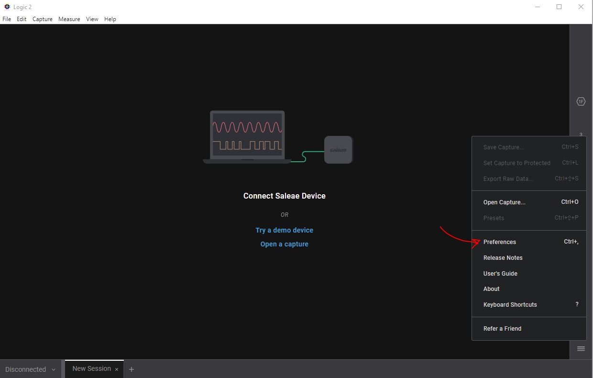

   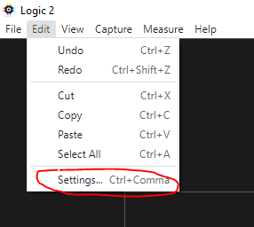

2. To import low level analyzer, in preferences, set the path of the folder that contains dll in **Custom Low Level Analyzers** field.

   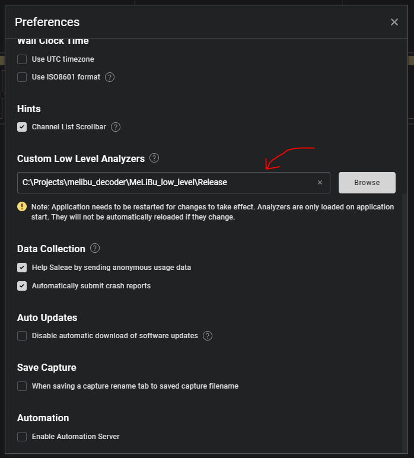

   - If there is no need to change code the user can use dll that is already built. In this case folder path that needs to be set is `..\MeLiBu_low_level\Release`
   - If the user wants to change code, firstly cmake must be used to build visual studio project. To do this check README file in MeLiBu_low_level folder (please use WINDOWS POWER SHELL for building with cmake). New **build** folder will be created.

   This folder contains visual studion project files and initial built dll. To make changes to code open .sln file with visual studio and when the code is changed rebuild solution in release mode.

   New dll is now located in `MeLiBu_low_level\build\Analyzers\Release`.

   New dll can be copied to `MeLiBu_low_level\Release` folder and this folder can be used in Logic app or Custom Low Level Analyzer folder can be set to folder where new dll is.

   Check images below.

   

   Build folder and .sln file

   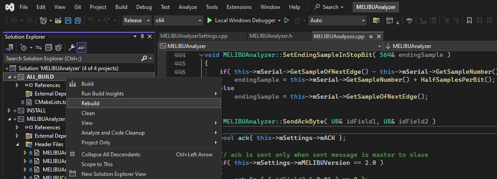

   Right click on ALL_Build Project and click Rebuild. Set Release mode for build.

3. Close the app and reopen it to make the changes visible!

4. To use the high level analyzer additional python packages must be installed. To do this check README file in `MeLiBu_high_level` folder.

5. Skip steps 5 and 6 if MeLiBu_high_level analyzer is visible in the list of Extensions.

6. To import the high level analyzer open **Extensions** on right vertical bar and choose **Load Existing Extension** (in drop down menu when clicking three dots in Extensions)

   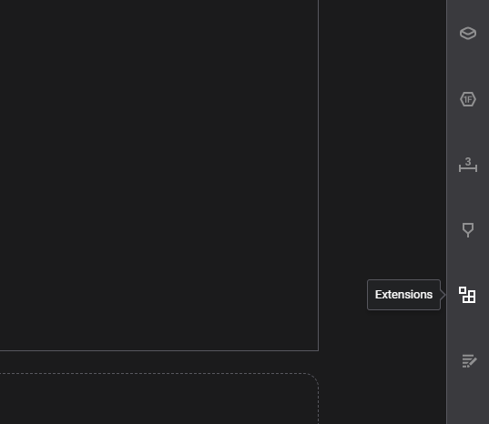

   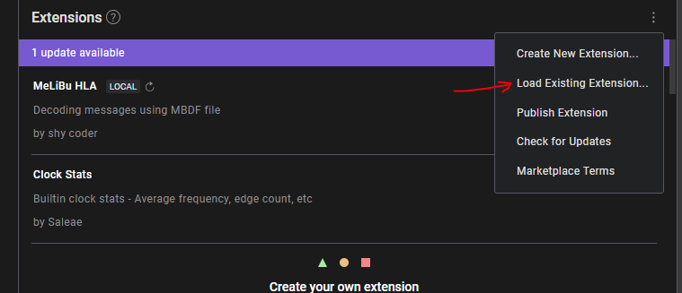

7. Find and select .json file in folder `MeLiBu_high_level` that was downloaded from git

   

## Setting Up Analyzers

When analyzer is imported it needs to be addded for use. To add analyzer go to Analyzers on right vertical bar and click on plus sign in upper right corner. Created analyzers names are **MeLiBu_low_level** and **MeLiBu_high_level.**

> Note: Low level analyzer can be used without the high level analyzer, but the high level analyzer can not be used without low level.

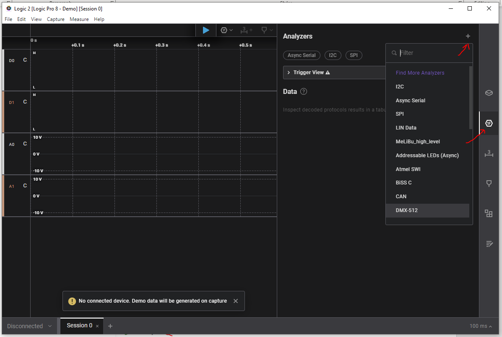

After analyzer is added it needs to be configured.

### Low Level Analyzer Configuration

Low level configuration window is shown below.

For Serial, select channel that is connected to COML.

Reception of ACK byte is configured with checkbox and it will be the same for every slave. If using MeLiBu 2 valid ACK value can be configured and it can be entered in decimal or hexadecimal format. If entered value couldn't be converted to number default value 0x7E will be used. For MeLiBu 1 this value is 0x7E and it does not need to be configured. Click *Save* to save changes.

### High Level Analyzer Configuration

As previously mentioned, high level analyzer can be used only if low level is configured. Configuration for the high level analyzer is shown below.

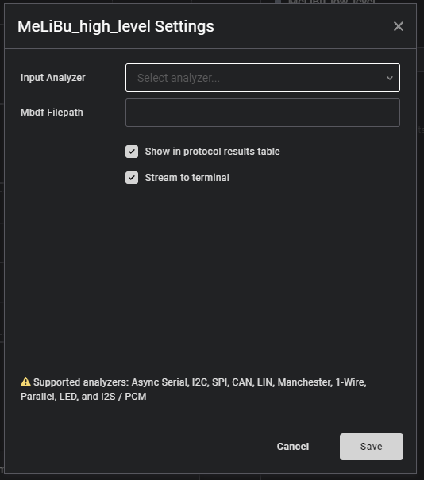

For input analyzer user shoud choose previously configured low level analyzer. Also, to use the high level analyzer appropriate MBDF file must exists.

MBDF file path can not be browsed, so the user should locate the file, copy its address and enter it in *Mbdf Fileptah* field. File path can be entered either with or without quotation marks.

To change configuration navigate to three dots next to analyzer and click edit. Other options can be found there (Delete, Select Color, ...)

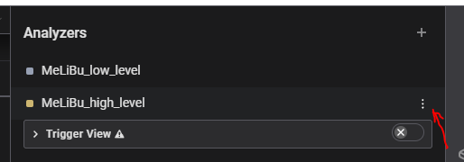

## Load/Capture Data

Capturing data can be started either before or after adding analyzers. When the data is captured with configured analyzers it will be decoded in parallel with acquisition.

There are two ways to start and stop the capture. It can be done either with the *blue play button* or from the menu at the top (*Capture*).

If there is no connected Saleae device simulated data can be generated (also using the blue play button) or old capture can be loaded.

To load old capture, navigate to *File, Open Capture* in menu at the top. File with .sal extension needs to be chosen. This type of file is created with Logic app too.

To save capture user should navigate to *File, Save Capture* and choose where to save it.

When simulating data, data that will be generated is determined with *simulation_data.csv* file located in *melibu_decoder/MeLiBu_low_level* folder. Each row in the file has a different message with bytes values. Byte values to be generated are hexadecimal numbers. Messages in the file will be generated repeatedly. User can change this file to test analyzers with different messages. To create byte with wrong stop bit just add -- before number.

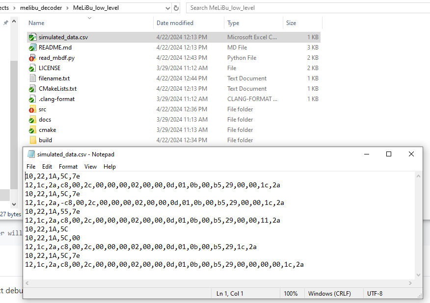

## Data Representation

Frames information is shown in two places. Basic info is displayed above graph in bars for each frame and more detailed info can be found in table placed right from the graph view.

On the graph different types of markers can be seen when zoomed in. Markers show where data was sampled during processing. Data bits are sampled with zero and one markers while start and stop bits have special markers (green circle for the start bit and orange square for the stop bit). There are also error markers to indicate data errors. Typers of errors will be explained in the other section.

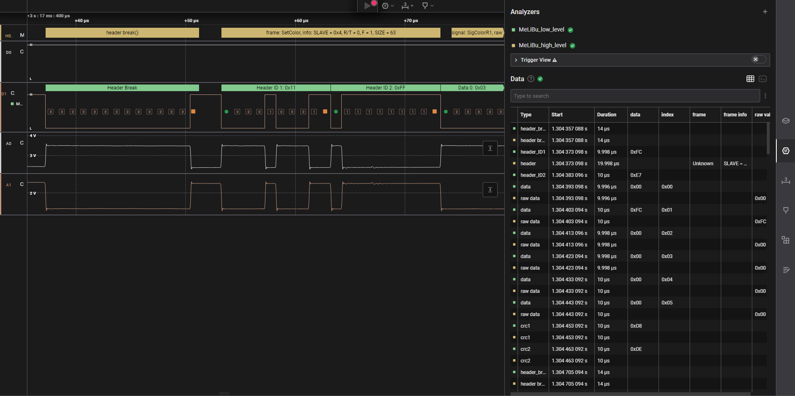

For tabular view there are several options. Those options can be found by clicking on the three dots next to the *Type to search* text input in *Data* section.

Data from all analyzers will be mixed in the table and the user can distinguish them by color, but can also choose which data will be shown in table by selecting analyzers in table options.

There is also an option to export table that is currently shown in csv format. This is very useful for filtering data by some errors or message types for example.

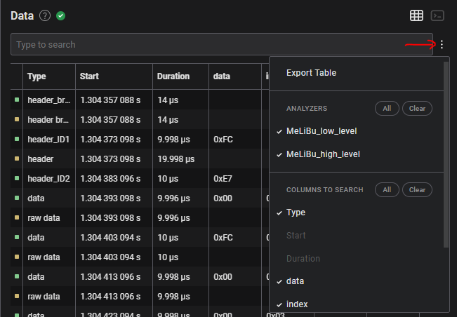

To match a frame from the graph view with a row in the table, navigate to the bar and press *ctrl+click*. To show a row from table in the graph view, navigate to the row and click on arrow on the right that appears.

### Low Level Analyzer

Bars above graph only have frame type name (header break, data, header id1, ...) and raw hexadecimal representation value (no value for header break). In table there are always Type, Start (start time of frame), Duration, data and index (only for data bytes) columns. If there is no errors in messages no other column will be generated.

### High Level Analyzer

Higl level analyzer bars and table have information about specific communication messages. Each message is matched with frame from MBDF file, raw values are decoded and real values with units are shown.

**Header fields** are connected in one bar. Matched frame name(s) and extracted subfields values are shown in this bar. Same info can be found in table in column name *frame info*. This field is not empty only for header so it is easy to notice start of a message. For MeLiBu 2 two **instruction bytes** (if they are sent after header) are connected with two header bytes and instruction field is added in bar and table.

**Data** rows have additional fields *signal, raw value* and *actual value.* Data bytes in one message are matched with signals based on previously mathed frame and signals in frame from MBDF file. Data bar connects bytes that has signal value part. If signal parts are not connected because of signal offset bar will be placed in first value chunk but whole value will be displayed. This situation can happen for MeLiBu 1.

**Multiple data** rows can be seen instead of data rows when multiple frames from MBDF matches values from header fiels. In this case signal names, raw values and actual values from different possible frames will be shown in separte columns named *sig alternative 1, raw alternative 1, actual alternative 1, sig alternative 2, raw alternative 2, actual alternative 2, ...* Maximum frame matches is 5 which means that signals from first five matches will be displayed. Each data bar will have same length and multiple signals name, raw value and actual value. Each signal in one bar belongs to one of matched frames. Because of multiple signals match, position of signals on graph won't be real position in message as it is when there is only one match.

**Crc fields** are connected in one bar and whole value is displayed.

**Header break** and **ack** byte do not have additional info in bars or table.

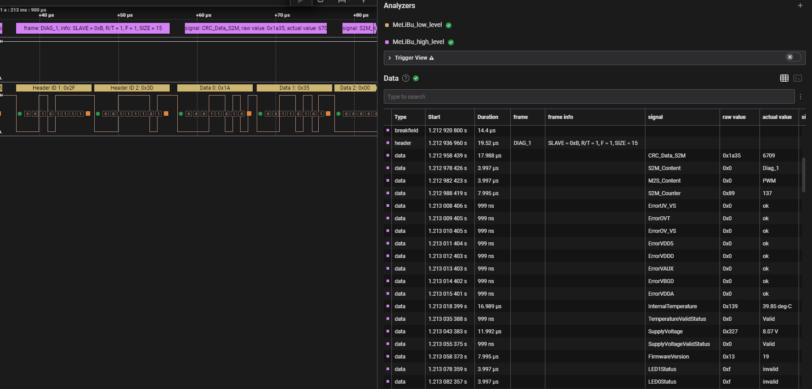

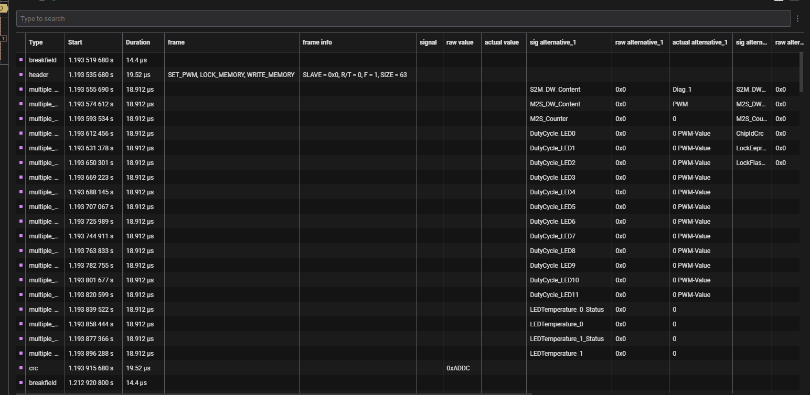

When header fields do not match any frame from MBDF file frame is displayed as *Unknown,* but all subfield values are extraced and shown normally. Data bytes after this header has type *raw data* and only have values in raw value column.

This situation can happen if combination of subfield values does not match any combination from frames in MBDF or when slave address is not found in MBDF. When this happens it does not always mean it is an error in communication, but it can mean that configuration messages are sent.

### Supported Errors

There are five types of error that are added as rows in tabular view: *byte framing error, header break expected, crc mismatch, reception failed* and *header toggling*. If there is an error new column will show up in table with name that describes error. It is easy to notice an error because all fields in its column will be empty except the ones where the error occured. For crc mismatch calculated crc will be displayed and for other errors the value is **true**.

* **Byte framing error**: stop bit wasn't valid (low value instead of high)
* **Header break expected**: searching for break and less than 13 low bits detected
* **Crc mismatch**: calculated crc does not match frames value
* **Reception failed**: ack byte value is not 0x7E
* **Header toggling**: searching for header break but before break found some high values

There is a *missing byte* error that will be visible as new row in place where byte frame should have been found. This situation can happen if less data bytes are sent than expected or if ack byte is missing for example.

Apart from error columns in table there are error markers added in graph view.

For low stop bit (byte framing error) error square is added. For high start bit error dot is added but this error is not added in table because next low bit will be taken as start bit.

For crc mismatch different text is visible in low level analyzer bar and next to stop bit marker, error square marker is added to indicate mismatch.

For ack value different from 0x7E error square marker is added after stop bit marker.

When there is header toggling when finding break field error x marker is added on every rising edge until break is found.

## Export Low Level Analyzer Custom Table

Except from the results table, custom table for low level analyzer can be exported. This can be done when clicking on three dots next to added analyzer and choosing *Export to TXT/CSV*. This table has basic information (it is not detailed as results table). Column names are *Type*, *Time*, *Value* and *Error*.

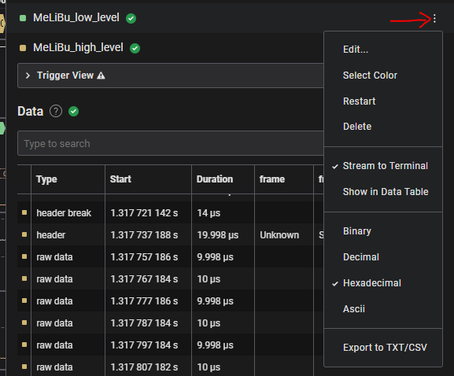

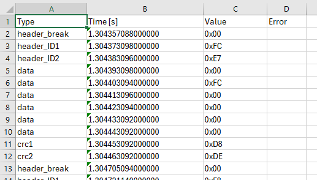
